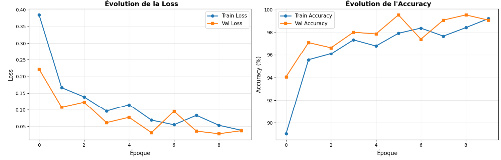
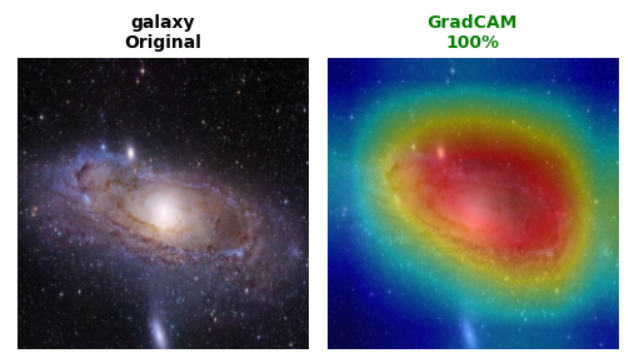

# Astrophysical Object Classification with ResNet18 and GradCAM

This project presents a complete deep-learning pipeline for classifying astrophysical objects using a fine-tuned ResNet18 and visual interpretability through GradCAM. The dataset includes multiple categories of celestial objects organized into training, validation, and test sets.

---

## Dataset Overview
The dataset is structured into three splits, each containing a folder per astrophysical class. A global exploration includes:

- Counting images per class
- Visualizing representative samples
- Inspecting dataset consistency

This provides a clear understanding of class distribution and variance before training.

---

## Data Processing and Augmentation

### Training Transformations
- Resize to 256×256  
- Random crop to 224×224  
- Horizontal flip  
- Rotation  
- Color jitter  
- Normalization (ImageNet mean and std)

### Validation and Test Transformations
- Resize to 224×224  
- Normalization (ImageNet mean and std)

All samples are loaded using PyTorch DataLoaders for efficient batching and shuffling.

---

## Model Architecture

A ResNet18 pre-trained on ImageNet is adapted to astrophysical image classification. Early layers are frozen to retain generic low-level visual features, while deeper layers are fine-tuned:

- Frozen blocks: conv1, bn1, layer1, layer2  
- Trainable blocks: layer3, layer4  
- Fully connected layer replaced to match the number of classes  

Parameter statistics are computed to quantify the share of trainable weights relative to the full model.

---

## Training Procedure

The training loop uses:

- Loss: Cross-Entropy  
- Optimizer: Adam  
- Scheduler: ReduceLROnPlateau (triggered by validation accuracy)  
- Epochs: 10  

Metrics recorded at each epoch include:

- Training loss  
- Validation loss  
- Training accuracy  
- Validation accuracy  

Two plots summarize performance evolution:

### Loss Curve/Accuracy Curve

---

## Evaluation

The model is evaluated on the separate test set. The evaluation involves:

- Global accuracy  
- Complete classification report  
- Confusion matrix  
- Per-class accuracy distribution  
## Model Performance

The final model reaches **97.10% accuracy** on the test set, showing strong generalization across all astrophysical classes.  
The classification report indicates consistently high precision, recall, and F1-scores, with several categories achieving perfect metrics.  
Remaining errors are minimal and occur mainly between visually similar objects, confirming the robustness of the fine-tuned ResNet18.

## GradCAM Visual Explanations

GradCAM is applied to inspect how the network interprets astrophysical structures. For each selected sample, the following visualizations are produced:

- Original image  
- GradCAM heatmap overlay  
- Activation heatmap alone  

### Example

A class-wide GradCAM study is also included, showing multiple GradCAM interpretations for each category of the dataset.

---

## Summary

- Fine-tuned ResNet18 for astrophysical image classification  
- Comprehensive training and evaluation pipeline  
- GradCAM-based visual interpretation  
- Detailed metric tracking and confusion-matrix analysis  
- Exported full model checkpoint for future reuse
## Author

**Nawfal Benhamdane**  
Student at CentraleSupélec 
